# BPC Project

## Install

```bash
git clone git@github.com:nilsimda/bpc-project.git && cd bpc-project
uv venv --python 3.10 # seems to work better with fairseq
uv pip install subword-nmt
uv pip install fairseq
source .venv/bin/activate
```

## Prepare dataset

```bash
./prepare.sh

```

Here is how it works:

```mermaid
graph TD
    %% Input Files
    A[📁 Original Input Files<br/>input.hsb & input.de<br/>in ./dataset/original/] --> B{📋 Validation Check<br/>Files exist?<br/>Dependencies installed?}
    
    B -->|❌ Missing| C[🛑 Exit with Error<br/>- Check input files<br/>- Install subword-nmt<br/>- Install fairseq<br/>- Install bc]
    B -->|✅ Valid| D[🧹 Clean Previous Runs<br/>Remove files from output dirs]
    
    %% Moses Preprocessing Chain
    D --> E[📝 Step 1: Normalize Punctuation<br/>normalize-punctuation.perl<br/>→ corpus.norm.hsb/.de]
    E --> F[🔤 Step 2: Tokenization<br/>tokenizer.perl -a<br/>→ corpus.tok.hsb/.de]
    F --> G[🧽 Step 3: Clean Corpus<br/>clean-corpus-n.perl<br/>Remove length 1-100 filter<br/>→ corpus.clean.hsb/.de]
    G --> H[🎓 Step 4: Train Truecaser<br/>train-truecaser.perl<br/>→ truecase-model.hsb/.de]
    H --> I[📐 Step 5: Apply Truecasing<br/>truecase.perl<br/>→ corpus.tc.hsb/.de]
    
    %% Data Splitting
    I --> J[📊 Step 6: Data Splitting<br/>Calculate split sizes:<br/>80% train, 10% dev, 10% test]
    J --> K[✂️ Split Source Files<br/>head/tail commands<br/>→ train.hsb, dev.hsb, test.hsb]
    J --> L[✂️ Split Target Files<br/>head/tail commands<br/>→ train.de, dev.de, test.de]
    
    %% BPE Processing
    K --> M[🔗 Step 7: Learn BPE<br/>Combine train.hsb + train.de<br/>→ train_combined.txt]
    L --> M
    M --> N[🧠 Learn BPE Codes<br/>subword-nmt learn-bpe<br/>16000 operations, min-freq 2<br/>→ bpe.codes]
    N --> O{📏 BPE Validation<br/>Codes file created?<br/>Non-empty?}
    O -->|❌ Failed| P[🛑 BPE Error<br/>Reduce BPE_OPERATIONS<br/>for small datasets]
    O -->|✅ Success| Q[🔧 Step 8: Apply BPE<br/>subword-nmt apply-bpe<br/>to all train/dev/test splits]
    
    %% Fairseq Processing
    Q --> R[📦 Step 9: Fairseq Preprocessing<br/>fairseq-preprocess<br/>Create binary dataset]
    R --> S[📈 Statistics Generation<br/>Count sentences at each stage<br/>Display processing summary]
    
    %% Output Structure
    S --> T[📁 Final Directory Structure]
    T --> U[📂 ./dataset/original/<br/>├── input.hsb<br/>└── input.de]
    T --> V[📂 ./dataset/output_moses/<br/>├── Normalized/tokenized files<br/>├── train/dev/test splits<br/>├── truecase models<br/>└── final_corpus.txt]
    T --> W[📂 ./dataset/output_bpe/<br/>├── bpe.codes<br/>├── train_combined.txt<br/>└── *.bpe files for all splits]
    T --> X[📂 ./dataset/fairseq/<br/>├── dict.hsb.txt<br/>├── dict.de.txt<br/>├── train.hsb-de.hsb.bin/idx<br/>├── train.hsb-de.de.bin/idx<br/>├── valid.hsb-de.hsb.bin/idx<br/>├── valid.hsb-de.de.bin/idx<br/>├── test.hsb-de.hsb.bin/idx<br/>└── test.hsb-de.de.bin/idx]
    
    %% Ready for Training
    X --> Y[🚀 Ready for NMT Training<br/>Transformer IWSLT architecture<br/>fairseq-train command<br/>Multi-GPU setup ready]
    
    %% Styling
    classDef inputFile fill:#e1f5fe,stroke:#01579b,stroke-width:2px
    classDef process fill:#f3e5f5,stroke:#4a148c,stroke-width:2px
    classDef decision fill:#fff3e0,stroke:#e65100,stroke-width:2px
    classDef error fill:#ffebee,stroke:#c62828,stroke-width:2px
    classDef output fill:#e8f5e8,stroke:#2e7d32,stroke-width:2px
    classDef final fill:#fff8e1,stroke:#f57f17,stroke-width:3px
    
    class A,U inputFile
    class E,F,G,H,I,J,K,L,M,N,Q,R,S process
    class B,O decision
    class C,P error
    class V,W,X output
    class Y final
```



```
